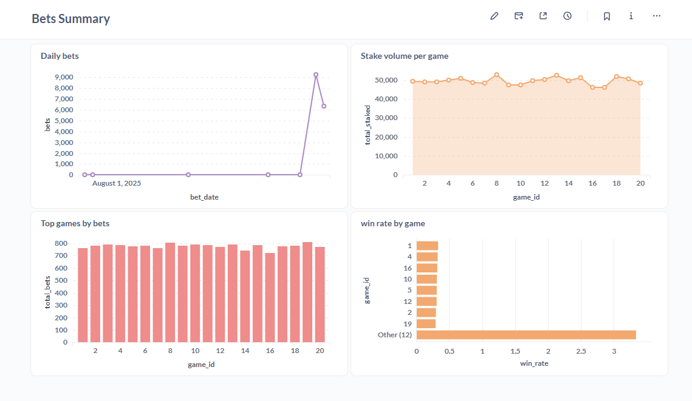

# Architecture

```mermaid
flowchart LR
  A["Generator<br/>(generate_bets.py)"] -->|JSON events| B(("Redpanda<br/>Kafka"))
  B --> C["Consumer → Postgres<br/>kafka_to_postgres.py"]
  B --> D["Mirror → MinIO (JSON/JSONL)<br/>kafka_to_minio&#42;.py"]
  D --> E["Compaction → Parquet<br/>compact_parquet.py"]
  C --> F["dbt models<br/>stg_bets, fact_bet, daily_game_metrics"]
  F --> G["Metabase"]
  E --> H["DuckDB (ad-hoc)"]

```

## Dashboard Snapshot

