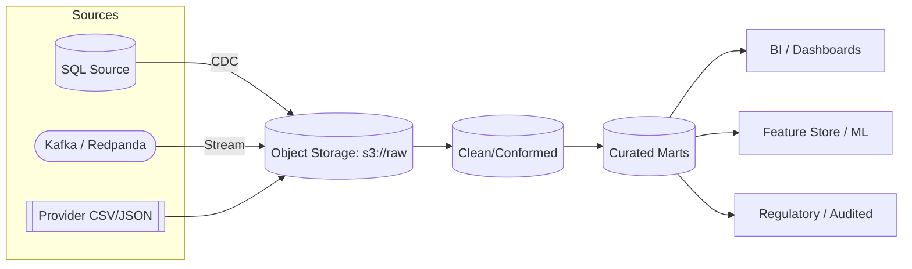

# Architecture

```mermaid
flowchart LR
  subgraph Sources
    SQL[(SQL Source)]
    KAFKA([Kafka / Redpanda])
    FILES[[Provider CSV/JSON]]
  end

  SQL -->|CDC| RAW[(Object Storage: s3://raw)]
  KAFKA -->|Stream| RAW
  FILES --> RAW

  RAW --> SILVER[(Clean/Conformed)]
  SILVER --> GOLD[(Curated Marts)]
  GOLD --> BI[BI / Dashboards]
  GOLD --> DS[Feature Store / ML]
  GOLD --> REG[Regulatory / Audited]
```
