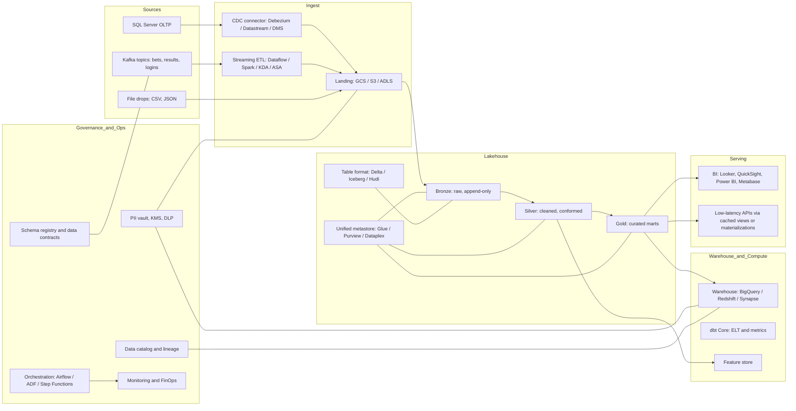
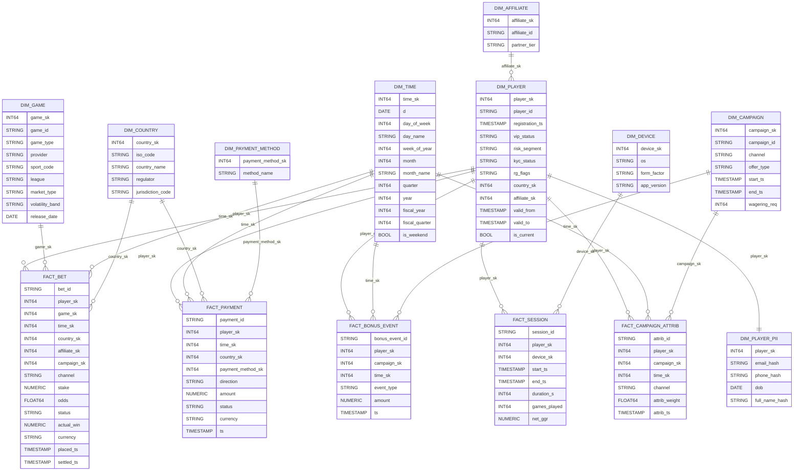

# Data Engineer Interview Packet – iGaming (BetMatrix)

This write-up proposes a modern, cost-efficient, multi-cloud capable data platform and answers the technical SQL and data-modeling questions. Primary reference design uses **GCP** (BigQuery), with service mappings for **AWS** and **Azure** at the end.

---

## Case Study Solution: Modern Cloud Data Platform

### Goals
- **Ingest**: SQL Server CDC, Kafka events, large CSV/JSON file drops
- **Scale**: Burst 5× during peak sporting events
- **Serve**: BI (governed metrics) + Advanced analytics (feature store / ML)
- **Cost**: Object-storage first, serverless/elastic compute, tiering & caching
- **Trust**: Strong governance, PII protection, auditability, data contracts

### High-level Architecture
**Zoom page to see details**


### Why these components?

- **Object-storage first** (GCS/S3/ADLS) keeps costs low; everything lands once, immutable “Bronze”.
- **Open table formats** (Delta/Iceberg/Hudi) + a **unified catalog** give ACID semantics, schema evolution, time-travel, and cheap lake queries from multiple engines (Spark, Trino, DuckDB, BigQuery external, Athena, Synapse Serverless).
- **Streaming + batch**: Kafka topics are consumed continuously (seconds latency) while file drops and CDC run on micro-batches. One governance plane.
- **dbt** standardizes **ELT** logic and **metric definitions** (dimensional models, tests, docs) for consistent KPIs.
- **Security & privacy**: PII tokenization at ingest, envelope encryption (KMS), DLP classifiers, row/column security in the warehouse, audit logs for regulators.

### Concrete service choices

- **GCP (primary)**  
  - Ingest: *Datastream* (SQL Server CDC) → GCS; *Dataflow* or *Pub/Sub* for streams (or Confluent Cloud); *Storage Transfer Service* for files.  
  - Lakehouse: GCS + **BigLake** tables with **Iceberg/Delta**, **Dataplex** catalog.  
  - Warehouse: **BigQuery** (scheduled & streaming inserts), **dbt** via Cloud Build/Composer.  
  - BI/ML: Looker Studio/Looker; **Vertex AI Feature Store**; notebooks.  
  - Orchestration/ops: **Cloud Composer** (Airflow), Cloud Monitoring, Cloud KMS, DLP.

- **AWS (mapping)**  
  - Ingest: **DMS** (SQL Server CDC), **MSK**/Kinesis, **Glue** for files → **S3**.  
  - Lakehouse: S3 + **Iceberg** (Glue Catalog), **Athena**, EMR/Spark.  
  - Warehouse: **Redshift Serverless**; dbt on MWAA or GitHub Actions.  
  - BI/ML: **QuickSight**, SageMaker Feature Store.  
  - Orchestration: Step Functions / MWAA, CloudWatch, KMS, Macie.

- **Azure (mapping)**  
  - Ingest: **ADF** + **Azure Data Explorer** / Event Hubs; CDC to **ADLS**.  
  - Lakehouse: ADLS + **Delta Lake** (Unity Catalog via Databricks or Purview).  
  - Warehouse: **Synapse Serverless/Dedicated** or **Fabric**; dbt on ADF/Databricks.  
  - BI/ML: **Power BI**, Databricks Feature Store.  
  - Orchestration: ADF pipelines, Monitor, Key Vault, Purview.

### Handling 5× event spikes

- **Decouple** producers/consumers via Kafka; enable **auto-scaling** for stream processors (Dataflow autoscaling / KDA / Stream Analytics).  
- **Backpressure**: Keep ingestion durable in object storage; consumers resume.  
- **Warehouse**: Use serverless/elastic (BigQuery slots, Redshift Serverless WLM, Synapse DWU autoscale).  
- **Storage**: Partition by **date/hour**; cluster by `player_id`, `game_id` to prune scans.  
- **Cost control**: Reserved slots (BQ), short-lived materializations, result cache, and **tiering** (nearline for cold data).

### Serving BI and advanced analytics

- **BI marts (GOLD)**: Star schemas with conformed dims feed BI tools; dbt tests maintain KPI consistency.  
- **Feature store**: Daily aggregates & real-time features (e.g., last 24h stake, win streaks) published for models (churn, RG, fraud).  
- **Low-latency APIs**: Materialized views / cache layers for realtime dashboards.

### Governance, security, compliance (iGaming)

- **PII strategy**: Hash/tokenize player identifiers at ingest; split PII to a restricted domain; decrypt only in secure projects.  
- **Row/column security**: Region-based access (regulatory), sensitive columns masked.  
- **Lineage & audit**: Catalog lineage (dbt + Dataplex/Purview/Glue). Immutable audit logs.  
- **Data contracts**: Kafka **Schema Registry** with compatibility rules; CI checks reject breaking changes.  
- **Retention**: Policy-based deletion/anonymization for GDPR and regulator SLAs.

---

## Technical Questions – SQL

Assume a `fact_bet` (or `stg_bets`) with:
```
bet_id, player_id, game_id, game_type, placed_at, stake, odds, status, actual_win
```
(If `game_type` lives in a `dim_game`, join on `game_id`.)

### 1) Top 5 players by total bet amount in past 30 days, by game type

**Generic ANSI SQL (works on most warehouses):**
```sql
WITH bets_30 AS (
  SELECT
    b.player_id,
    COALESCE(b.game_type, g.game_type) AS game_type,
    b.stake
  FROM fact_bet b
  LEFT JOIN dim_game g ON g.game_id = b.game_id
  WHERE b.placed_at >= CURRENT_DATE - INTERVAL '30' DAY
),
agg AS (
  SELECT
    game_type,
    player_id,
    SUM(stake) AS total_stake
  FROM bets_30
  GROUP BY game_type, player_id
),
ranked AS (
  SELECT
    game_type,
    player_id,
    total_stake,
    ROW_NUMBER() OVER (PARTITION BY game_type ORDER BY total_stake DESC) AS rn
  FROM agg
)
SELECT game_type, player_id, total_stake
FROM ranked
WHERE rn <= 5
ORDER BY game_type, total_stake DESC;
```

> Engines with `QUALIFY` (BigQuery/Snowflake) can replace the last CTE with `QUALIFY ROW_NUMBER()… <= 5`.

---

### 2) CTEs – detect possible problem gambling behavior  
**Find players whose daily betting total increases ≥ 50% for 3 consecutive days**, show average before vs during, and sort by increase.

```sql
WITH daily AS (
  SELECT
    player_id,
    CAST(placed_at AS DATE) AS d,
    SUM(stake) AS day_stake
  FROM fact_bet
  GROUP BY player_id, CAST(placed_at AS DATE)
),
chg AS (  -- compute day-over-day % change
  SELECT
    player_id,
    d,
    day_stake,
    LAG(day_stake) OVER (PARTITION BY player_id ORDER BY d) AS prev_stake,
    CASE
      WHEN LAG(day_stake) OVER (PARTITION BY player_id ORDER BY d) > 0
      THEN (day_stake - LAG(day_stake) OVER (PARTITION BY player_id ORDER BY d))
           / LAG(day_stake) OVER (PARTITION BY player_id ORDER BY d)
      ELSE NULL
    END AS pct_increase
  FROM daily
),
inc AS (  -- mark days that are >= +50% vs previous day
  SELECT
    player_id, d, day_stake, prev_stake, pct_increase,
    CASE WHEN pct_increase >= 0.50 THEN 1 ELSE 0 END AS inc_flag
  FROM chg
),
runs AS (  -- find consecutive runs of inc_flag=1 using gaps-and-islands
  SELECT
    player_id, d, day_stake,
    -- only consider days where inc_flag = 1
    SUM(CASE WHEN inc_flag = 1 THEN 1 ELSE 0 END)
      OVER (PARTITION BY player_id ORDER BY d
            ROWS BETWEEN 2 PRECEDING AND CURRENT ROW) AS three_day_window,
    -- group key for consecutive days (islands)
    (d - INTERVAL '1' DAY * ROW_NUMBER() OVER (PARTITION BY player_id ORDER BY d)) AS grp_key,
    inc_flag
  FROM inc
  WHERE inc_flag = 1
),
streaks AS (  -- keep groups with length >= 3 (i.e., 3 consecutive inc days)
  SELECT
    player_id,
    MIN(d) AS streak_start,
    MAX(d) AS streak_end,
    COUNT(*) AS streak_len
  FROM runs
  GROUP BY player_id, grp_key
  HAVING COUNT(*) >= 3
),
before_after AS (  -- compute averages before (3 days) vs during streak
  SELECT
    s.player_id,
    s.streak_start,
    s.streak_end,
    s.streak_len,
    -- avg of daily stake during the streak
    (SELECT AVG(day_stake) FROM daily d
     WHERE d.player_id = s.player_id AND d.d BETWEEN s.streak_start AND s.streak_end) AS avg_during,
    -- avg of daily stake for the 3 days immediately before the streak
    (SELECT AVG(day_stake) FROM daily d
     WHERE d.player_id = s.player_id
       AND d.d >= s.streak_start - INTERVAL '3' DAY
       AND d.d <  s.streak_start) AS avg_before
  FROM streaks s
)
SELECT
  player_id,
  streak_start,
  streak_end,
  streak_len,
  avg_before,
  avg_during,
  CASE WHEN avg_before IS NOT NULL AND avg_before > 0
       THEN (avg_during - avg_before) / avg_before
       ELSE NULL
  END AS pct_increase_overall
FROM before_after
ORDER BY pct_increase_overall DESC NULLS LAST, streak_len DESC;
```

---

## Data Modeling

### 1) Dimensional schema (warehouse grain: **bet**)

**Fact tables**
- `fact_bet` (**grain**: one row per bet)  
  Columns: `bet_id (PK)`, `player_sk`, `game_sk`, `session_sk (nullable)`, `time_sk`, `channel`, `stake`, `odds`, `status {won|lost|cashout|void}`, `actual_win`, `currency`, `placed_ts`, `settled_ts`, `country_sk`, `affiliate_sk`, `campaign_sk`.
- `fact_payment` (deposits/withdrawals; grain: one txn)  
  `payment_id`, `player_sk`, `amount`, `method`, `status`, `ts`, `country_sk`.
- `fact_session` (optional; grain: one session)  
  `session_id`, `player_sk`, `device_sk`, `start_ts`, `end_ts`, `duration_s`, `games_played`, `net_ggr`.
- `fact_campaign_attribution` (bridge between player and campaign over time).

**Dimensions**
- `dim_player` (**SCD2**): `player_sk (PK)`, `player_id (bk)`, `dob (masked)`, `gender (optional)`, `vip_status`, `risk_segment`, `registration_ts`, `country_sk`, `kyp_status`, `rg_flags`, `valid_from`, `valid_to`, `is_current`.  
- `dim_game`: `game_sk`, `game_id (bk)`, `game_type {sports|casino|poker|virtual}`, `provider`, `sport_code`, `league`, `market_type`, `volatility_band`, `release_date`.  
- `dim_time` (date/time with fiscal attributes).  
- `dim_country` / `dim_geo`: `country_sk`, `iso_code`, `regulator`.  
- `dim_campaign`: `campaign_sk`, `campaign_id`, `channel`, `start_ts`, `end_ts`, `offer_type`, `wagering_req`.  
- `dim_affiliate`: `affiliate_sk`, `affiliate_id`, `partner_tier`.  
- `dim_device`: `device_sk`, `os`, `form_factor`, `app_version`.

**Marts (Gold)**
- `mart_daily_game_metrics` (by day, game): `day`, `game_sk`, `bets`, `handle`, `wins`, `ggr`, `win_rate`.  
- `mart_player_ltv` (cumulative): `player_sk`, `days_since_reg`, `ggr_cum`, `deposits_cum`, `withdrawals_cum`, `bonus_cost_cum`, `ltv_net`.

**Modeling notes**
- Use **surrogate keys** (`*_sk`) and treat source IDs as business keys (`bk`).
- Sensitive attributes go in a **restricted PII schema**; use tokenization and **row-level security** so analysts only see anonymized joins.
- Store currency amounts in **minor units** with a separate `fx_rate` table if multi-currency.

**example** 


---

### 2) Star vs Snowflake – Trade-offs for iGaming

**Star (denormalized dims)**  
Pros: Fast, simple joins for BI; fewer joins under burst load; best for dashboards.  
Cons: Repeated attributes across dims; slightly higher storage; SCD maintenance in each dim.

**Snowflake (normalized dims)**  
Pros: Reduces duplication (e.g., `dim_game` → `dim_game` + `dim_provider` + `dim_sport`); clearer conformance; easier to manage hierarchies (country → regulator).  
Cons: More joins → higher latency; analysts face complexity.

**Recommendation**  
- **Hybrid**: Keep **star** for primary BI marts (`fact_bet` + `dim_*` denormalized enough for common slices: game type, country, campaign).  
- **Light snowflake** where hierarchy is shared broadly (e.g., `dim_country` referenced by many facts; `dim_provider` snowflaked from `dim_game`).  
- For **detailed player journey**, create a **wide event table** (append-only, with partitioning) alongside the fact table: analysts can drill down without harming BI marts.

**Detail**
For iGaming analytics, a star schema is typically best for performance and usability. Dimensions are denormalized (e.g., game, player, campaign) so BI tools can slice KPIs quickly with minimal joins. This makes daily operational reporting, regulator packs, and dashboards much faster and simpler for analysts. A snowflake schema, by contrast, normalizes hierarchies (e.g., splitting provider or country into separate tables). That reduces duplication and helps manage shared hierarchies, but increases join complexity and query latency under load.

Because the business needs both speed and governance, a hybrid approach is most effective: core marts (bets, payments, bonuses) are modeled in a star form for KPI consistency, while certain shared hierarchies (e.g., regulator, game provider) can be lightly snowflaked for maintainability.

To satisfy the second requirement—supporting both aggregated reporting and detailed player journey analysis—the design deliberately has two “lanes” that share the same conformed dimensions:

- **Aggregated reporting lane**: curated “Gold” fact tables and marts (e.g., daily game metrics, lifetime value) structured in a star schema. These are optimized for bursty dashboards, regulator snapshots, and simple KPI reporting.

- **Player journey lane**: an append-only, event-oriented table that records every interaction (bets, deposits, logins, bonus grants, etc.) tied back to the same surrogate keys as the marts. This provides a detailed chronological view of a player’s journey, supporting session analysis, funnels, and risk detection.

By keeping both lanes aligned on the same surrogate keys and conformed dimensions, analysts and business users can drill from a high-level KPI down to the exact sequence of player events that produced it. The marts deliver speed and consistency, while the event-level tables deliver depth and behavioral insight—together meeting both executive reporting and advanced analytics needs without forcing one design to serve both extremes.

---

### 3) ETL vs ELT in the cloud – and what to use here

**short notes**
**ETL** (transform before loading): good when you **must** process/cleanse PII before it touches shared storage or when upstream schemas are unstable.

**ELT** (load, then transform in the warehouse/lakehouse): leverages cheap storage + elastic compute; faster iteration; lineage and tests via dbt.

**Recommendation for BetMatrix**
- **SQL Server (player accounts, payments)**: **ETL-leaning CDC**.  
  - Run **CDC/replication** with **PII tokenization/encryption at ingest** (e.g., Datastream/DMS + Dataflow/Spark transform) → land to `Bronze_PII` (restricted).  
  - Expose only masked / minimal columns downstream (`Silver`) with strict RBAC.
- **Kafka game events & provider files (bets, results, logins)**: **ELT**.  
  - Land raw JSON/CSV to `Bronze` (partitioned), validate against **Schema Registry** / data contracts, then **ELT with dbt** into `Silver/Gold`.  
  - This keeps throughput high during 5× spikes and minimizes transform bottlenecks.

**detailed explanation of thought process**
**What’s the difference?**

**ETL (Extract → Transform → Load)**: Data is cleaned/transformed before it enters shared storage/warehouse. Good for strict data-minimization, stable outputs, and keeping sensitive fields out of broad environments. Trade-off: more upfront engineering, slower iteration.

**ELT (Extract → Load → Transform)**: Land data quickly into cheap object storage/warehouse, then transform with elastic, serverless compute (e.g., dbt + warehouse). Great for speed, scale, schema evolution, and cost control. Trade-off: requires strong governance (RBAC, masking, DLP) because raw data lands first.

**Cloud-specific context**

Object storage + serverless compute makes ELT the default for cost/scale/agility.
ETL still matters when regulations or risk demand pre-load controls (tokenize, encrypt, drop fields) to avoid broad exposure.
A pragmatic design often blends both: ETL at the “trust boundary”, then ELT for modeling and marts.

**My recommendation for the two sources in scope**

Sensitive player data from SQL Server (accounts, payments, PII) → ETL-leaning pipeline
**Why**: Regulatory and privacy risk (PII, RG/AML). We minimize exposure by transforming before broad landing.

**How**:

Use CDC/replication from SQL Server.
Tokenize/hash player identifiers and encrypt sensitive fields in-flight/at ingest.
Land into a restricted domain (e.g., secure “Bronze_PII” bucket/project) with tight IAM, then expose only masked/minimal columns downstream.
After that protection step, proceed with ELT in the warehouse/lake for modeling (SCD2 dims, marts).
Result: Satisfies data-minimization and auditability while still leveraging cloud ELT for speed.

Game data from file exports / streaming events (CSV/JSON, Kafka providers) → ELT-first
**Why**: High volume, semi-structured, frequent schema tweaks; needs rapid ingestion and scalable transforms.

**How**:

Land raw quickly in object storage (partitioned by date/hour).
Enforce data contracts and schema validation (schema registry/tests) on load to keep quality high without blocking ingestion.
Use dbt/warehouse for incremental ELT into Silver/Gold (typing, conforming, metrics).
Add materialized views/caches for hot aggregates and autoscale to absorb 5× event spikes.
Result: Maximizes agility and cost-efficiency, with governance handled by contracts, lineage, and RBAC.

**Bottom line**

Player PII (SQL Server): ETL at the boundary (tokenize/encrypt/suppress) → then ELT for modeling.

Game/event files: ELT-first (land fast, validate, transform in warehouse).
This split gives BetMatrix the control regulators expect and the velocity the business needs.

---

## Service Mapping Cheat-Sheet

| Capability                  | GCP (primary)                 | AWS                         | Azure                               |
|----------------------------|-------------------------------|-----------------------------|-------------------------------------|
| SQL Server CDC             | Datastream → GCS              | DMS → S3                    | ADF/CDC → ADLS                      |
| Kafka ingestion            | Confluent Cloud / Dataflow    | MSK / Kinesis Data Analytics| Event Hubs / Stream Analytics       |
| Landing / Lake             | GCS                            | S3                          | ADLS Gen2                           |
| Table format + Catalog     | BigLake + Dataplex (+ Iceberg)| Iceberg + Glue Catalog      | Delta Lake + Purview / Unity        |
| Warehouse                  | BigQuery                       | Redshift Serverless         | Synapse / Fabric                    |
| Orchestration              | Cloud Composer (Airflow)      | MWAA / Step Functions       | ADF / Data Factory                  |
| BI                         | Looker / Looker Studio        | QuickSight                  | Power BI                            |
| Feature Store              | Vertex AI Feature Store        | SageMaker Feature Store     | Databricks Feature Store            |
| Security                   | KMS, DLP, VPC-SC              | KMS, Macie                  | Key Vault, Purview                  |

---

## Appendix – Performance & Cost Tips

- **Partition + cluster** facts by `placed_at` and common predicates (`game_id`, `player_id`).  
- Use **materialized views** for hot aggregates (daily metrics); refresh on a schedule or when new partitions arrive.  
- **Result cache** and **BI extract caches** for stable dashboards.  
- **Storage tiers**: move cold `Bronze` to nearline/infrequent access; keep `Gold` hot.  
- **Autoscaling** streams; use spot/preemptible for Spark when batch-processing files.  
- **dbt tests**: nulls, accepted values, referential integrity; alert on failures (CI/GitHub Actions).

